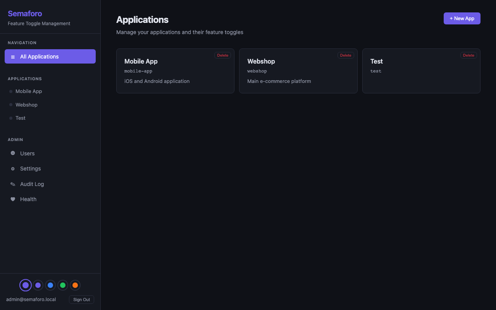
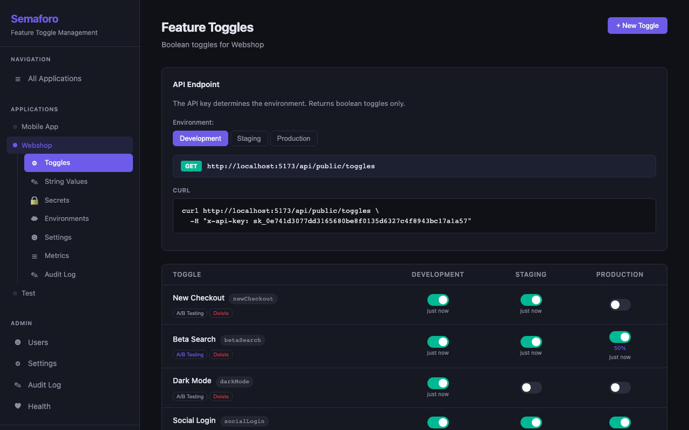
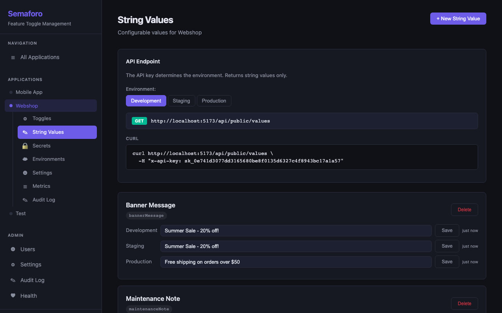
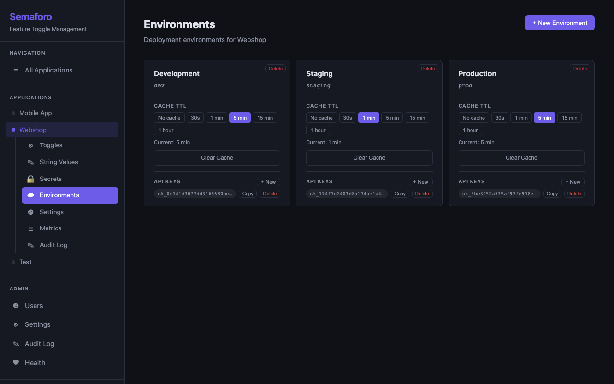
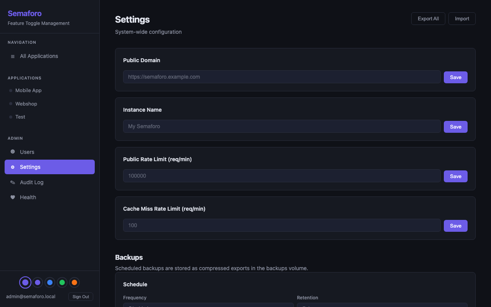
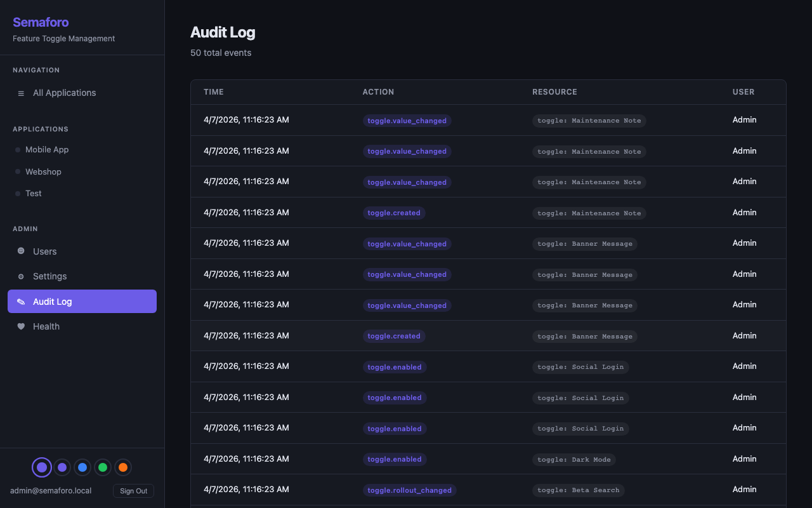
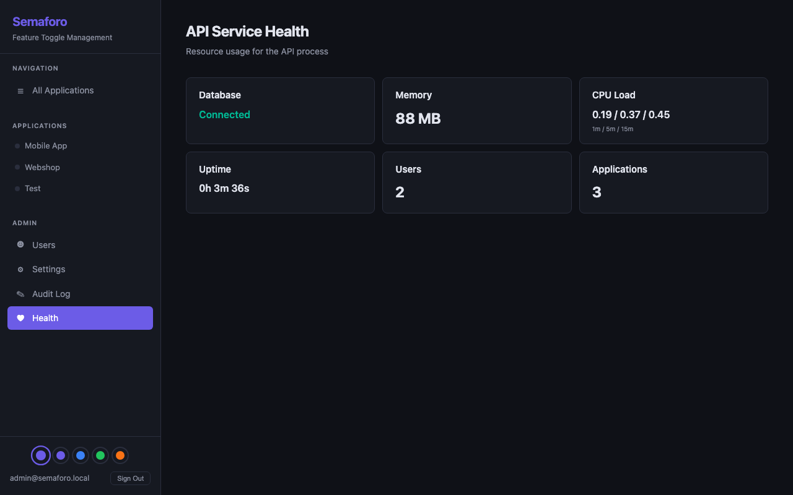

# Semaforo

Feature toggle management platform with A/B testing, string values, encrypted secrets, per-app access control, request metrics, and an admin panel.

## Screenshots

| Applications | Feature Toggles |
|:---:|:---:|
|  |  |

| String Values | Environments |
|:---:|:---:|
|  |  |

| Admin Settings | Audit Log |
|:---:|:---:|
|  |  |

| API Health |
|:---:|
|  |

## Quick Start

Semaforo can run in two modes:

### Standalone Mode

Single-process, no external dependencies. All data stored as JSON files. Best for local development, demos, and small teams.

```bash
npm install
npm run build
npx semaforo
```

Open http://localhost:3001 — both API and web UI are served from one process. Login with `admin@semaforo.local` / `admin`.

Data is stored in `~/.semaforo/` by default. JWT secret and encryption key are auto-generated on first run. Nothing else to configure.

```bash
npx semaforo --port 8080                   # custom port
npx semaforo --data-dir ./my-data          # custom data directory
npx semaforo -c ./config.json              # custom config file location
npx semaforo --no-watch                    # disable hot reload (production)
npx semaforo -d                            # start as background daemon
npx semaforo status                        # check if running
npx semaforo logs                          # tail last 50 lines
npx semaforo logs -f                       # follow log output
npx semaforo stop                          # stop the daemon
```

Hot reload is enabled by default in all modes (foreground and daemon) — source changes restart the server automatically. Use `--no-watch` to run the compiled build instead.

### Docker Mode

PostgreSQL + Redis backed. Hot-reloading for development, production-ready for deployment.

```bash
./start.sh
```

This generates a `.env` file with random secrets (if missing) and starts all services in detached mode. Alternatively: `docker compose up -d`.

- **API** at http://localhost:3001
- **Web UI** at http://localhost:5173
- **PostgreSQL** at localhost:5432
- **Redis** at localhost:6379

### Mode Comparison

| | Standalone | Docker |
|---|---|---|
| **Setup** | `npm install && npm run build` | `./start.sh` |
| **Dependencies** | Node.js 20+ only | Docker |
| **Database** | JSON files on disk | PostgreSQL 16 |
| **Cache** | In-memory | Redis 7 |
| **Storage** | `~/.semaforo/` (configurable) | Docker volumes |
| **Ports** | Single port (default 3001) | API: 3001, Web: 5173 |
| **Scaling** | Single instance | Multiple instances possible |
| **Hot reload** | Yes (via tsx watch, default) | Yes (source mounted) |
| **Best for** | Local dev, demos, small teams | Production, multi-user |

All features (toggles, string values, secrets, A/B testing, metrics, audit log, backups, admin panel) work in both modes.

### Docker Mode Environment Variables

Configured via `.env` file (created automatically by `start.sh`):

| Variable | Description | Required |
|----------|-------------|----------|
| `JWT_SECRET` | Secret for signing admin/session JWT tokens | Yes |
| `SDK_JWT_SECRET` | Secret used to sign the `x-user-id` JWT consumed by the public API. Distribute to SDK consumers so they can mint per-request identity tokens. | Yes |
| `ENCRYPTION_KEY` | 32-byte hex key for AES-256-GCM secret encryption | Yes |
| `CORS_ORIGIN` | Allowed CORS origin | Yes (defaults to `http://localhost:5173` in docker-compose) |
| `NO_WATCH` | Set to any value to disable hot reload (builds and runs compiled JS) | No |

All four secrets are **required** — the API will fail-fast on startup if any is missing. Set `NO_WATCH=1` in `.env` to disable hot reload for production deployments.

In standalone mode, `JWT_SECRET`, `SDK_JWT_SECRET`, and `ENCRYPTION_KEY` are auto-generated on first run and stored in `config.json` — no `.env` file needed.

## Default Credentials

A default admin user is created on first startup:

| Field | Value |
|-------|-------|
| Email | `admin@semaforo.local` |
| Password | `admin` |

## Features

### Boolean Toggles
On/off switches per environment. Manage via the Toggles page — grid of toggle x environment with instant switching.

### String Values
Configurable text values per environment (e.g., banner messages, feature labels). Managed on a dedicated String Values page with per-environment inputs and a Save button.

### Encrypted Secrets
Per-environment encrypted secrets (e.g., database passwords, API tokens). Values are encrypted at rest with AES-256-GCM using a master key. Each encryption uses a unique IV.

- **Admin UI**: Secrets page per app — create secrets, set values per environment, masked display with a Reveal button
- **Reveal is admin-only and audit-logged** — only users with the `admin` system role can call the reveal endpoint; every reveal action is recorded in the audit log
- **Public API**: Client apps fetch decrypted secrets via API key, same pattern as toggles

```bash
curl /api/public/secrets -H "x-api-key: sk_your_key_here"
```

Response:
```json
{
  "databasePassword": "s3cret",
  "stripeApiKey": "sk_live_..."
}
```

### A/B Testing
Per-toggle, per-environment rollout percentages (0-100%). Click "A/B Testing" on any boolean toggle to expand the rollout configuration. Set a percentage per environment and click "Apply".

- **With `x-user-id` JWT**: deterministic — same user always gets the same result (hash-based bucketing on the verified `userId` claim).
- **Without `x-user-id` JWT**: random per request.

The `x-user-id` header is a JWT signed with `SDK_JWT_SECRET` (HS256) carrying a `userId` claim. Unsigned or wrong-secret tokens are rejected with `401`. This prevents callers from spoofing arbitrary user identities to dodge percentage rollouts.

```js
// Server-side: mint a per-request identity token
import jwt from "jsonwebtoken";
const userIdToken = jwt.sign(
  { userId: "user-123" },
  process.env.SDK_JWT_SECRET,
  { algorithm: "HS256", expiresIn: "5m" },
);
```

```bash
# Deterministic A/B for a specific user
curl /api/public/toggles \
  -H "x-api-key: sk_..." \
  -H "x-user-id: $USER_ID_TOKEN"
```

### Metrics
Per-app metrics page with:
- Toggle and environment counts
- Cache status, size, and remaining TTL per environment
- Request counts: unflushed (Redis), 5m, 1h, 1d, 1w, 1mo
- Auto-refreshes every 5 seconds

Request tracking uses Redis INCR (zero latency) with a background flush to Postgres every 5 minutes.

### Audit Log
Every resource creation and status change is logged:
- App/environment/toggle creation
- Toggle enable/disable/rollout changes
- Member additions/removals
- Admin user and settings changes
- System imports

Per-app audit log (in each app's sidebar) and system-wide audit log (admin panel). All entries show resolved resource names, not UUIDs.

### Export / Import
- **Per-app**: Export/Import buttons on the app Settings page
- **Admin**: Export All / Import on the admin Settings page

Full instance export includes users (with bcrypt hashes), system settings, apps, environments, toggles, toggle values, rollout percentages, secrets (encrypted), app members, and API keys. The seed admin is excluded — fresh installs create it automatically.

### Scheduled Backups
Automated compressed backups (`.json.gz`) stored in the `./backups` volume. Configured from the admin Settings page:

- **Schedule**: Every hour, 12 hours, daily, or custom interval in hours
- **Retention**: 7 days, 15 days, 30 days, or custom number of days
- **Manual backup**: "Backup Now" button for on-demand backups
- **History**: Table showing all backup files with size and timestamp
- **Validate**: Dry-run a backup to check structure, count entities, and detect conflicts before restoring
- **Restore**: Restore a backup with a confirmation modal warning that existing conflicting data may be overwritten
- **Clean restore**: Optional checkbox to erase all existing data (apps, users, settings, audit logs) before restoring, keeping only the admin account and .env values

Old backups are automatically pruned based on the retention setting. Backups are bind-mounted at `./backups` so they persist outside Docker.

### Themes
Five built-in themes (Dark, Light, Midnight, Forest, Sunset) selectable from colored dots in the sidebar footer. Persisted in localStorage.

## Public API

The API key determines the environment. All endpoints use `x-api-key` header. Keys are managed per environment and auto-generated on environment creation.

### Boolean Toggles

```bash
curl /api/public/toggles -H "x-api-key: sk_your_key_here"
```

Single toggle: `/api/public/toggles/myToggle`

```json
{ "newCheckout": true, "betaSearch": false }
```

### String Values

```bash
curl /api/public/values -H "x-api-key: sk_your_key_here"
```

Single value: `/api/public/values/bannerMessage`

```json
{ "bannerMessage": "Welcome!", "maintenanceNote": "" }
```

### Secrets

```bash
curl /api/public/secrets -H "x-api-key: sk_your_key_here"
```

```json
{ "databasePassword": "s3cret", "stripeApiKey": "sk_live_..." }
```

### Full-path alternatives (backwards compatible)

```bash
curl /api/public/apps/my-app/environments/prod/toggles \
  -H "x-api-key: sk_your_key_here"

curl /api/public/apps/my-app/environments/prod/secrets \
  -H "x-api-key: sk_your_key_here"
```

## Access Control

### User Roles

| Role | Scope | Description |
|------|-------|-------------|
| `admin` | System-wide | Full access to admin panel, user management, system settings |
| `user` | System-wide | Can access apps they are a member of |

### App Member Roles

| Role | Description |
|------|-------------|
| `owner` | Full control over the application |
| `editor` | Can modify toggles and environments |
| `viewer` | Read-only access |

Members are managed in each app's **Settings** page.

## Admin Panel

Available at `/admin` in the web UI (admin role required).

- **Users** — Create, edit, disable, delete users; reset passwords; assign system roles
- **Settings** — Public domain, instance name, configurable rate limits, export/import
- **Audit Log** — Paginated log of all actions with resolved resource names
- **Health** — Database status, memory (MB), CPU load average (1m/5m/15m), uptime, user/app counts

## Security

- JWT authentication (HS256, algorithm pinned on both sign and verify) with required `JWT_SECRET` — no default.
- Separate `SDK_JWT_SECRET` for verifying the public-API `x-user-id` identity token, so a leaked SDK secret cannot be used to forge admin sessions.
- AES-256-GCM encryption for secrets at rest (unique IV per value, 32-byte master key). `ENCRYPTION_KEY` is required at startup.
- bcrypt password hashing (12 salt rounds). Login runs `bcrypt.compare` against a placeholder hash on user-not-found so response latency does not leak email existence.
- API keys are stored as SHA-256 hashes (`api_keys.key_hash`). The plaintext is returned exactly once at creation; a database dump exposes only hashes.
- Admin role is re-checked from the database on every `/api/admin/*` request, so demoting or disabling an account takes effect immediately rather than at JWT expiry.
- Secret reveal endpoint is admin-only.
- Zod schemas validate every mutating request body at the route boundary; malformed input returns 400 before the use case runs.
- Admin user listings never include `passwordHash`.
- Two-tier rate limiting: generous for cached responses (configurable, default 100k/min), strict for DB hits (configurable, default 100/min).
- Rate limits configurable via admin settings, stored in Postgres, served from Redis.
- Helmet security headers, CORS origin pinned via `CORS_ORIGIN`.
- API keys via `x-api-key` header only.
- Request body size limited to 1MB.
- Audit logging for all resource mutations (sensitive payloads like setting values are deliberately excluded from audit detail strings).
- Disabled users cannot log in.

## Development

### Standalone Mode (no database required)

```bash
npx semaforo
```

Zero-config startup — all data stored in `~/.semaforo/` as JSON files. Auto-generates JWT secret and encryption key on first run. Serves both API and web UI on port 3001.

Options:
```bash
npx semaforo --port 8080 --data-dir ./my-data
npx semaforo -c ./my-config.json
```

The config file (`config.json`) stores `jwtSecret`, `sdkJwtSecret`, `encryptionKey`, `dataDir`, and `port`. CLI flags override config file values. Default config location: `~/.semaforo/config.json`. Older `config.json` files lacking `sdkJwtSecret` are auto-migrated: a fresh value is minted and persisted on first run after upgrade.

The standalone mode can optionally connect to external PostgreSQL and/or Redis by adding them to the config file:

```json
{
  "jwtSecret": "...",
  "sdkJwtSecret": "...",
  "encryptionKey": "...",
  "port": 3001,
  "postgres": {
    "host": "localhost",
    "port": 5432,
    "user": "semaforo",
    "password": "semaforo",
    "database": "semaforo"
  },
  "redis": {
    "host": "localhost",
    "port": 6379
  }
}
```

- **No `postgres`/`redis`** — JSON files + in-memory cache (default)
- **`postgres` only** — PostgreSQL for storage, in-memory cache
- **`postgres` + `redis`** — PostgreSQL for storage, Redis for cache (same as Docker mode)

Migrations run automatically when connecting to PostgreSQL.

**Note:** With `--no-watch`, requires building first: `npm run build`. In default (hot reload) mode, no build step is needed.

### With Docker (recommended for production)

```bash
./start.sh
```

Source code is mounted as volumes — changes reload automatically.

### Without Docker (with PostgreSQL + Redis)

```bash
npm install
npm run build --workspace=@semaforo/domain

# Start API (requires local PostgreSQL and Redis)
JWT_SECRET=dev-secret \
  SDK_JWT_SECRET=$(openssl rand -hex 32) \
  CORS_ORIGIN=http://localhost:5173 \
  ENCRYPTION_KEY=$(openssl rand -hex 32) \
  npm run dev --workspace=@semaforo/api

# Start Web
npm run dev --workspace=@semaforo/web
```

### Running Tests

```bash
# All unit tests
npm test

# Domain tests only
npm test --workspace=@semaforo/domain

# API tests only
npm test --workspace=@semaforo/api
```

## Project Structure

```
apps/
  api/          Express.js backend
  web/          React + Vite frontend
packages/
  domain/       Domain entities, repository interfaces, business rules
  shared/       Validation patterns shared between api and web
  sdk/          @semaforo-flags/sdk — JavaScript/TypeScript client SDK
terraform/      Terraform provider (Go) for managing resources as IaC
docker/         Dockerfiles
docs/           Architecture and domain documentation
scripts/        Utility scripts (screenshot generation)
```

## JavaScript SDK

The `@semaforo-flags/sdk` package provides a TypeScript client for consuming Semaforo's public API from Node.js 18+ or browsers. Zero runtime dependencies.

```bash
npm install @semaforo-flags/sdk
```

```typescript
import { SemaforoClient } from "@semaforo-flags/sdk";

const client = new SemaforoClient({
  baseUrl: "https://your-instance.com",
  apiKey: "sk_your_api_key",
});

const darkMode = await client.getToggle("darkMode");
const banner = await client.getValue("bannerMessage");
const secrets = await client.getSecrets();

client.destroy(); // stop polling, clear cache
```

Features: typed errors, in-memory TTL cache (default 60s), interval-based polling with change detection (default 30s). See [packages/sdk/README.md](packages/sdk/README.md) for full documentation.

## Terraform Provider

A Terraform provider for managing Semaforo resources as infrastructure-as-code. Written in Go using terraform-plugin-framework.

```hcl
provider "semaforo" {
  url      = "https://your-instance.com"
  email    = var.admin_email
  password = var.admin_password
}

resource "semaforo_app" "shop" {
  name = "Shop"
  key  = "shop"
}

resource "semaforo_environment" "prod" {
  app_id            = semaforo_app.shop.id
  name              = "Production"
  key               = "prod"
  cache_ttl_seconds = 600
}

resource "semaforo_toggle" "dark_mode" {
  app_id = semaforo_app.shop.id
  name   = "Dark Mode"
  key    = "darkMode"
}

resource "semaforo_toggle_value" "dark_mode_prod" {
  app_id         = semaforo_app.shop.id
  toggle_id      = semaforo_toggle.dark_mode.id
  environment_id = semaforo_environment.prod.id
  enabled        = true
}
```

Resources: `semaforo_app`, `semaforo_environment`, `semaforo_toggle`, `semaforo_toggle_value`, `semaforo_secret`, `semaforo_secret_value`, `semaforo_api_key`. See [terraform/examples/main.tf](terraform/examples/main.tf) for a full example.

## API Endpoints

### Authentication

| Method | Path | Description |
|--------|------|-------------|
| POST | `/api/auth/login` | Login (returns JWT) |
| GET | `/api/auth/me` | Current user info |

### Applications

| Method | Path | Description |
|--------|------|-------------|
| GET | `/api/apps` | List all apps |
| POST | `/api/apps` | Create an app |
| GET | `/api/apps/:appId` | Get app details |
| GET | `/api/apps/:appId/metrics` | App metrics (toggles, cache, requests) |
| GET | `/api/apps/:appId/audit-log` | App audit log |
| GET | `/api/apps/:appId/export` | Export app as JSON |
| POST | `/api/apps/import` | Import app from JSON |
| DELETE | `/api/apps/:appId` | Delete app (cascades all data) |

### Environments

| Method | Path | Description |
|--------|------|-------------|
| GET | `/api/apps/:appId/environments` | List environments |
| POST | `/api/apps/:appId/environments` | Create environment (auto-generates API key) |
| PATCH | `/api/environments/:envId` | Update environment |
| DELETE | `/api/environments/:envId` | Delete environment (cascades data) |
| DELETE | `/api/environments/:envId/cache` | Clear environment cache |

### Toggles

| Method | Path | Description |
|--------|------|-------------|
| GET | `/api/apps/:appId/toggles` | List toggles |
| POST | `/api/apps/:appId/toggles` | Create toggle (type: boolean or string) |
| PUT | `/api/toggles/:toggleId/environments/:envId` | Set value (enabled, stringValue, rolloutPercentage) |
| DELETE | `/api/toggles/:toggleId` | Delete toggle (cascades values) |
| GET | `/api/apps/:appId/toggle-values` | All toggle values with timestamps |

### Secrets

| Method | Path | Description |
|--------|------|-------------|
| GET | `/api/apps/:appId/secrets` | List secrets (metadata only) |
| POST | `/api/apps/:appId/secrets` | Create secret |
| DELETE | `/api/secrets/:secretId` | Delete secret |
| PUT | `/api/secrets/:secretId/environments/:envId` | Set secret value (encrypted) |
| GET | `/api/secrets/:secretId/environments/:envId` | Get masked value |
| POST | `/api/secrets/:secretId/environments/:envId/reveal` | Reveal full value (admin role required, audit-logged) |

### API Keys (per environment)

| Method | Path | Description |
|--------|------|-------------|
| GET | `/api/environments/:envId/api-keys` | List API keys (metadata only — hashes, never plaintext) |
| POST | `/api/environments/:envId/api-keys` | Create API key. Response includes the plaintext exactly once — store it client-side immediately. |
| DELETE | `/api/api-keys/:keyId` | Delete API key |

API keys are stored as SHA-256 hashes (`api_keys.key_hash`); plaintexts never round-trip through the database. Listing keys after creation returns metadata only, never the original token.

### App Members

| Method | Path | Description |
|--------|------|-------------|
| GET | `/api/apps/:appId/members` | List members |
| POST | `/api/apps/:appId/members` | Add member |
| DELETE | `/api/apps/:appId/members/:memberId` | Remove member |

### Public (API key required)

| Method | Path | Description |
|--------|------|-------------|
| GET | `/api/public/toggles` | Get boolean toggles |
| GET | `/api/public/toggles/:toggleKey` | Get single toggle |
| GET | `/api/public/values` | Get string values |
| GET | `/api/public/values/:valueKey` | Get single value |
| GET | `/api/public/secrets` | Get decrypted secrets |
| GET | `/api/public/apps/:appKey/environments/:envKey/toggles` | Get toggles (full path) |
| GET | `/api/public/apps/:appKey/environments/:envKey/toggles/:toggleKey` | Get single toggle (full path) |
| GET | `/api/public/apps/:appKey/environments/:envKey/secrets` | Get secrets (full path) |

### Admin (admin role required)

| Method | Path | Description |
|--------|------|-------------|
| GET | `/api/admin/users` | List users |
| POST | `/api/admin/users` | Create user |
| PATCH | `/api/admin/users/:userId` | Update user |
| DELETE | `/api/admin/users/:userId` | Delete user |
| POST | `/api/admin/users/:userId/reset-password` | Reset password |
| GET | `/api/admin/settings` | List system settings |
| PUT | `/api/admin/settings/:key` | Update setting |
| GET | `/api/admin/audit-log` | Audit log |
| GET | `/api/admin/health` | API service health |
| GET | `/api/admin/backups` | List backup files |
| POST | `/api/admin/backups` | Create backup now |
| POST | `/api/admin/backups/:filename/validate` | Dry-run validate a backup |
| POST | `/api/admin/backups/:filename/restore` | Restore from a backup |
| GET | `/api/admin/export` | Export full instance |
| POST | `/api/admin/import` | Import full instance |

### Other

| Method | Path | Description |
|--------|------|-------------|
| GET | `/api/health` | Health check (public, for load balancers) |
| GET | `/api/docs` | Swagger UI |

## License

[MIT](LICENSE)
